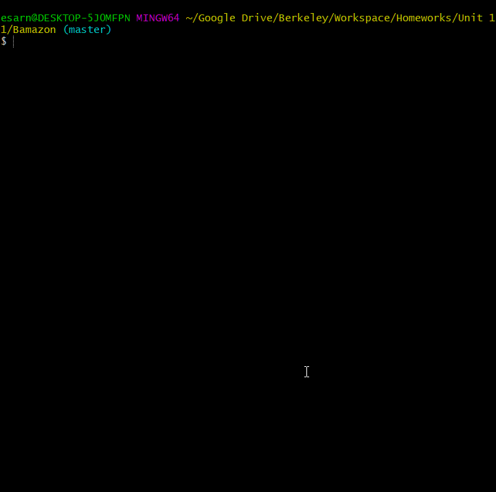
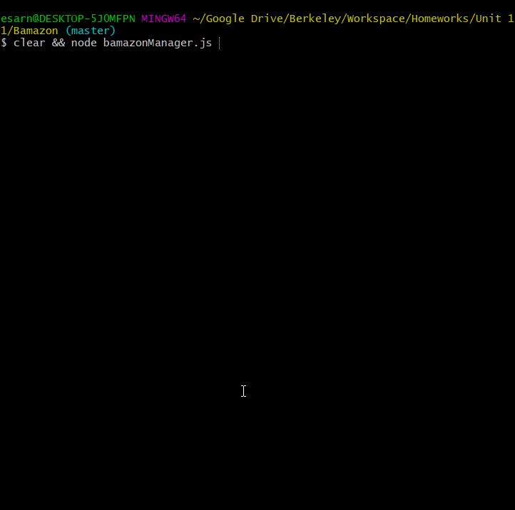

# Bamazon

SR Depo Customer Menu:

SR Depo Manager Menu:

Welcome to SR Depo! A convenient store for a variety of items, all inside of your terminal! 

As a customer, you may choose any item you'd like and specify the amount of that item to buy. As a manager, you may view all items, low on stock items, can re-stock items, and re-stock all items.

----

## Getting Started

     Please be aware, once you reach the MySQL step, all you need to do is install and start MySQL. The file toolset.js already handles the creation for the database and table for usage. The database is called "bamazon" and the table is called "products". If you need to change them, you may in the respective file under the function "createDB".

You will need all of the files in the repository, except for the git folder and readme file. Make sure the rest of the files are in one, singular project folder when downloading them.

You will also need to install [NodeJS](https://nodejs.org/) and the dependencies related to this project!

## Prerequisites

#### 1. Node JS

[NodeJS](https://nodejs.org/) Stable LTS version is recommended. 

Once NodeJS is all setup, you will need to open your Windows CommandPrompt or Mac/Ubuntu terminal, open into the project folder's directory and run:
`npm i`. This npm [(Node Package Manager)](https://www.npmjs.com/) command will check the package.json file to automatically install the dependencies into the Node_Modules folder. 

#### 2. MySQL

Once NPM has finished installing the packages, the next step is to install [MySQL](https://dev.mysql.com/doc/refman/8.0/en/installing.html) on your machine. You may set the user Root's password to anything you'd like to. However, make sure to update the config.json file to reflect those changes.

Once MySQL is setup, make sure it is running and can run on system startup. Then, run the project by: `node bamazonCustomer.js` or `node bamazonManager.js` to run those respective menus.

And that is all! You should now see SR Depo!
If you would like to change the table structure, you may look into toolset.js to manage how the database and table are created.

----

## Built With:

* [NodeJS](https://nodejs.org/): Runtime Application to run the Javascript files.
* [NPM](https://www.npmjs.com/): Package manager & installer for dependencies. 
* [MySQL](https://dev.mysql.com/doc/refman/8.0/en/installing.html): Database used to keep product items.

* [Inquirer](https://www.npmjs.com/package/inquirer): Package that creates a clean UI for Q&A on the terminal.
* [Colors](https://www.npmjs.com/package/colors): Package to add color to the prompts in the terminal.

## Authors

* **Esar Behlum**

## Future Goals

* Add currency system
* Add profiles with passwords
* Add personal table in each profile for purchased items/sell items.
* Convert the project into a web app using Express for an easy-access interface.
